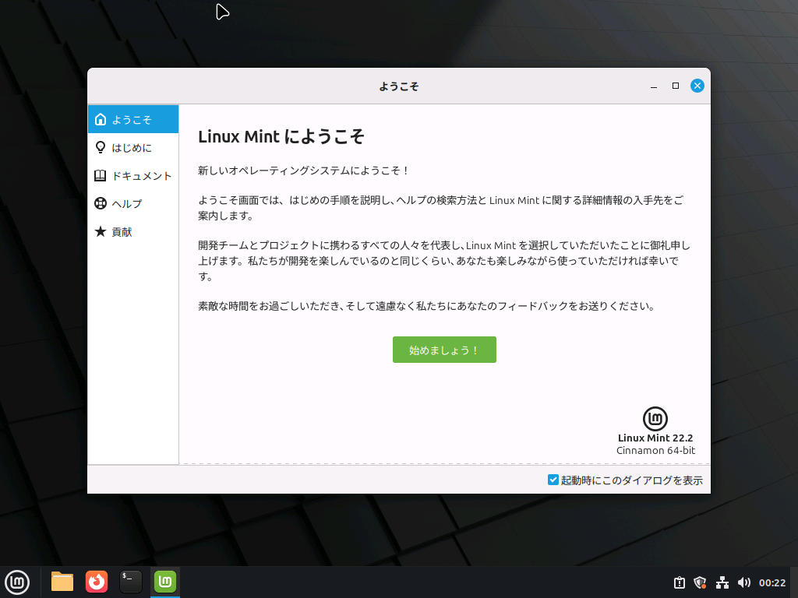
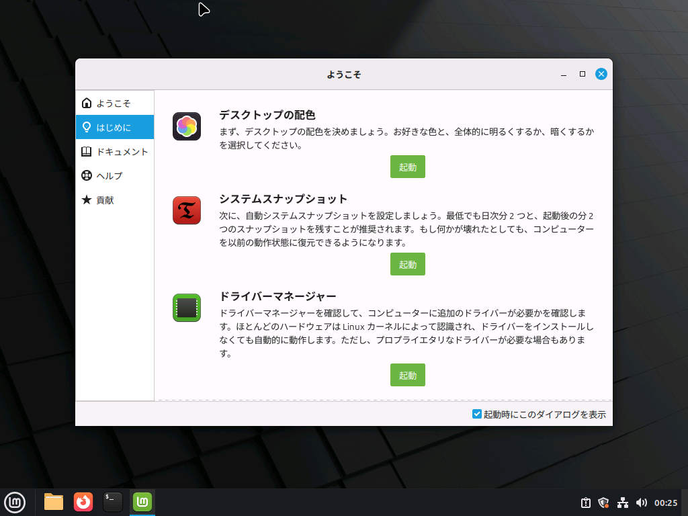
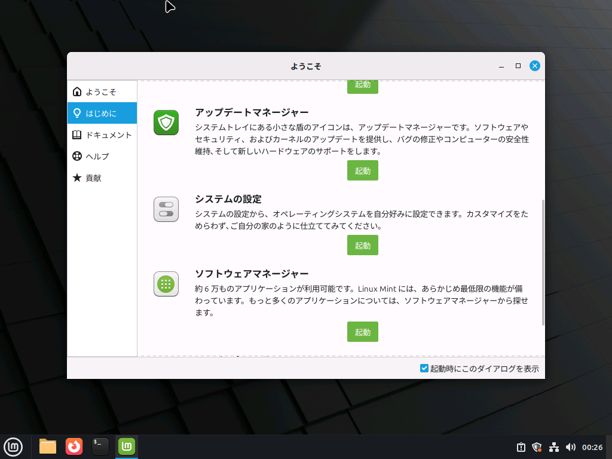

初回起動時、このような画面が現れます。

少し読んでみましょう。

:::tip 非表示にする方法

この画面を起動時に出ないようにするには、右下の「起動時にこのダイアログを表示」のチェックを外します。

:::

## ようこそ画面

### はじめに

画面に書いてあるとおりの説明です。配色などを自由に変更し、スナップショット（バックアップ）を必要に応じて取ることもできます。

アップデートマネージャーとソフトウェアマネージャーは、とても良く使用します。アイコンの見た目を覚えておきましょう。