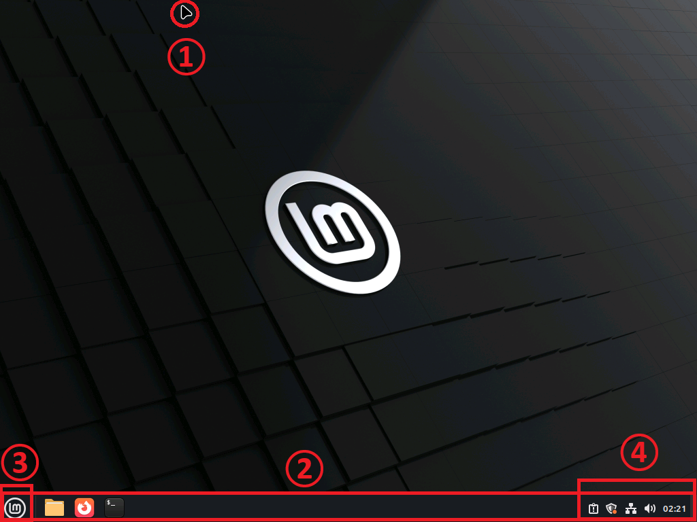
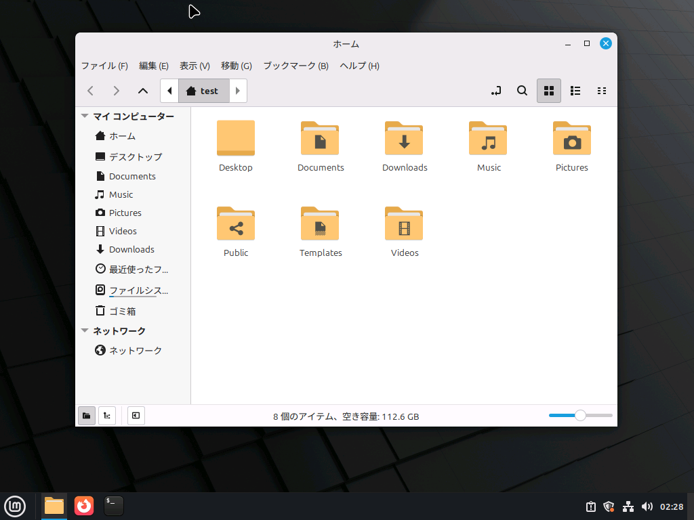
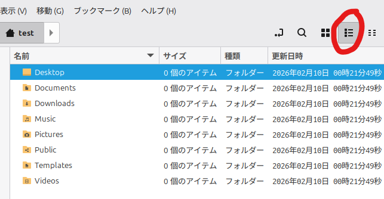

## 画面ボタンの名称

### ①マウスポインター（カーソル）

マウスと連動するカーソルです。Windowsっぽい見た目にすることもできます。

### ②パネル

Windowsでいう「タスクバー」です。アプリの切り替えなどを行います。

アプリを右クリックすると、ピン留めを行ったり外したりできます。ピン留めしたアプリは、起動していなくてもパネルに残ります。

### ③メニューボタン

Windowsでいう「スタートボタン」です。アプリ一覧を開くことができます。

### ④システムトレイ

Windowsでいう「通知領域」です。重要な通知などがここに来ます。音量などの調整も可能です。

## ウィンドウの名称

フォルダの並び方はMacっぽいですが、右上のボタンの使い方はWindowsと同じです。

ちなみに、ここを押すと「リスト表示」になり、Windowsの表示にグッと近づきます。