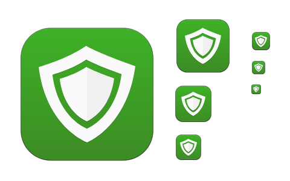
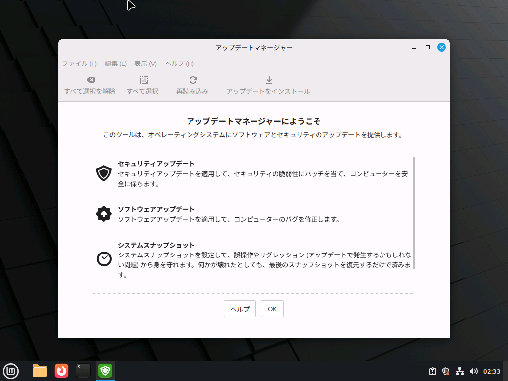
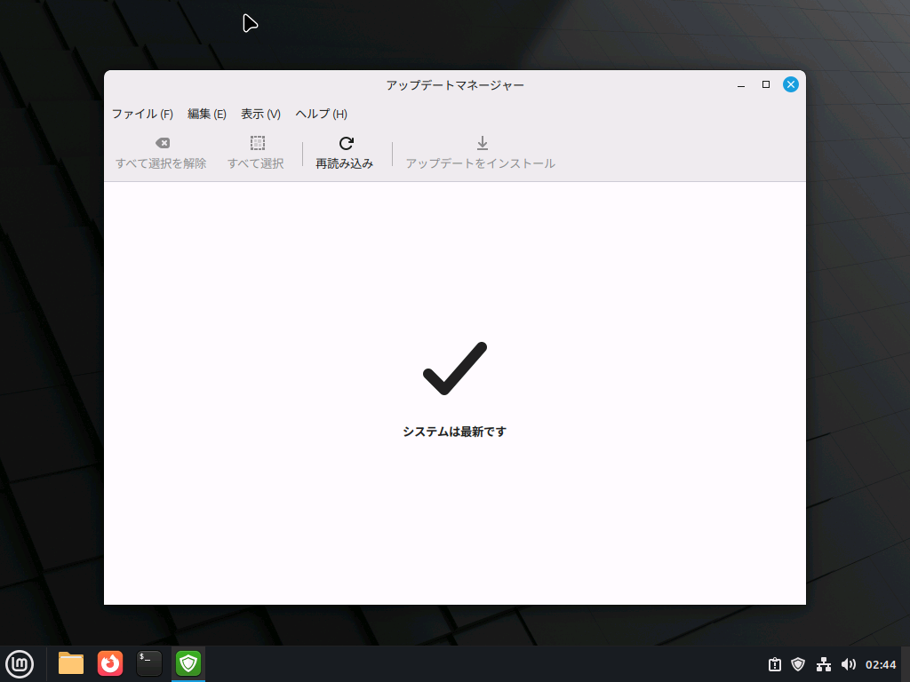
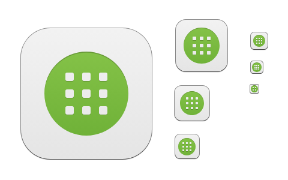
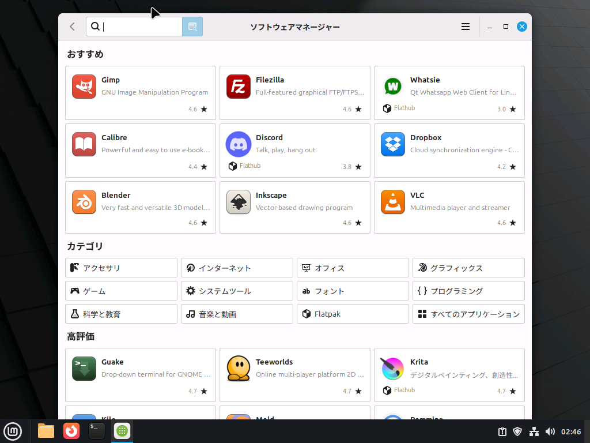
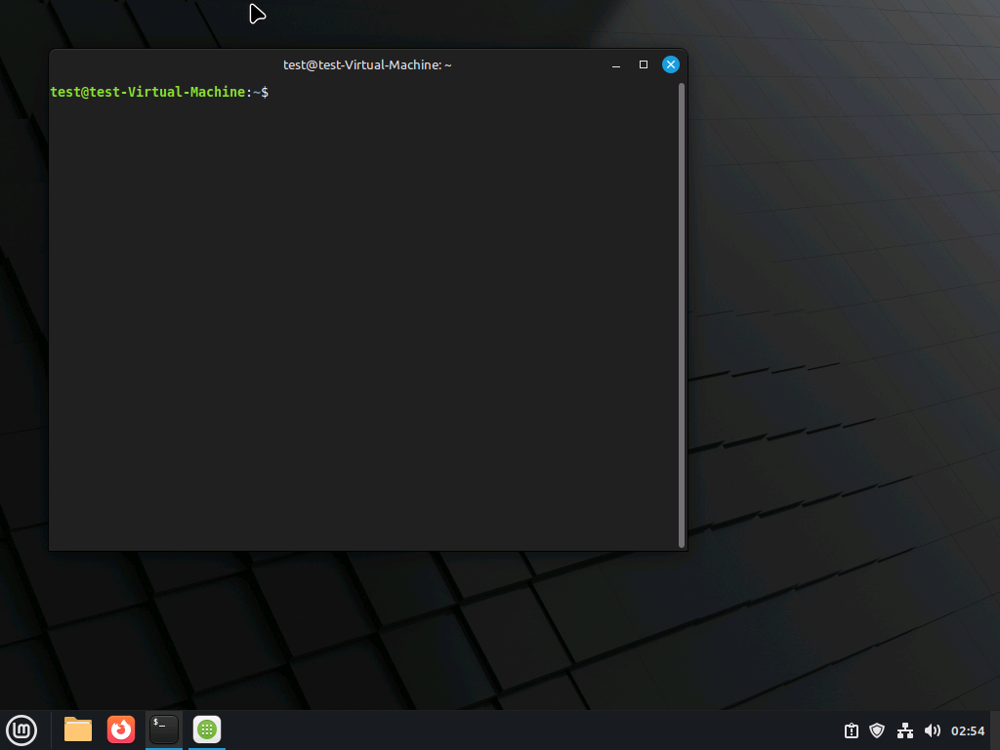

頻繁に使う重要なアプリをいくつか紹介します。このページにあるアプリは、最初からLinux Mintに入っています。

## システム系

### アップデートマネージャー

引用元：https://mintguide.miraheze.org/wiki/Update_Manager#/media/File:Mint-y-icons_src_apps_mintupdate.svg

アップデートマネージャーは、Linux Mint本体と、入っているほぼすべてのアプリのアップデートを一括で行えるアプリです。

初回起動時はこのような画面になります。OKを押して進めます。

この状態になっていれば、特にすることはありません。これ以外の画面になっている場合は、アップデートを画面の指示に従って行うだけでシステムが最新の安全な状態になります。

### ソフトウェアマネージャー

引用元：https://mintguide.miraheze.org/wiki/Software_Manager#/media/File:Mint-y-icons_src_apps_mintinstall.svg

色々なアプリをインストールできます。

特徴的なのは、Flatpak（フラットパック） という仕組みに対応している点です。

通常、Linuxのアプリはシステムの深い部分と密接に関係していますが、Flatpakは「アプリ専用の箱」に入れて動かしています。これにより、システムの安定性を損なうことなく、最新バージョンのアプリを安全に利用できます。

## ネット系

### Firefox（ブラウザ）

ブラウザ（Webを見るときに使用するアプリ）の一種です。WindowsだとChromeやMicrosoft Edge、iOSユーザーの方だとSafariなどが馴染み深いでしょうか。

FirefoxはLinux Mintで標準となっており、プライバシー重視のブラウザとしても人気です。

### Thunderbird

メールアプリです。WindowsでいうOutlookに相当します。カレンダー機能もあります。

## オフィス系

### LibreOffice（リブロオフィス）

Microsoft Officeと高い互換性を持つオフィスソフト一式です。Linux Mintでは最初から入っています。

- LibreOffice Writer：ワープロです。Microsoft WordやGoogleドキュメントと互換性があります。
- LibreOffice Calc：表計算です。Microsoft ExcelやGoogleスプレッドシートと互換性があります。
- LibreOffice Impress：プレゼンテーションです。Microsoft PowerPointやGoogleスライドと互換性があります。
- LibreOffice Draw：図形描画・PDF編集ができます。

すべて無料で利用できます。

### ファイル（Nemo）

Windowsでいうエクスプローラーです。

フォルダの並び方はMacっぽいですが、右上のボタンの使い方はWindowsと同じです。

ちなみに、ここを押すと「リスト表示」になり、Windowsの表示にグッと近づきます。

## 上級者向け

### ターミナル

「パソコンに詳しい人が使う黒い画面」のことを、ターミナルと呼びます。

Linux Mintはほとんどの操作がボタンのクリックで完結しますが、たまに必須となる場面があります。

:::tip コピー・ペースト

ターミナルでコピー・ペーストをする場合は、以下の操作になります。右クリックメニューからでも実行できます。

- コピー：`Ctrl+Shift+C`
- ペースト：`Ctrl+Shift+V`

:::

:::danger

知らない人からもらったコードを、よく確認せずにターミナルに貼り付けることが絶対にないようにしてください！Linuxのターミナルは、OSのシステムファイルを破壊できるほどの強力な権限を持っています。

:::