ソフトウェアマネージャー以外からアプリを入れる方法をご紹介します。

:::warning

怪しいアプリを入れると困ったことになるのは、Windowsと何も変わりません。アプリを入れる前に、そのサイトが本物かどうか確認するなど十分注意してください。

:::

## `deb`ファイル

`.deb（デブ）`ファイルは、Windowsでいうところの`.exe`や`.msi`に相当するファイルです。

Google ChromeやZoomなど、有名なアプリの公式サイトで「Linux用をダウンロード」を選択すると、この形式のファイルが手に入ることが多いです。

### インストールの手順

1. 公式サイトから`.deb`ファイルをダウンロードします。
2. ダウンロードしたファイルをダブルクリックします。
3. 「パッケージインストーラー」 という画面が立ち上がるので、「パッケージをインストール」 ボタンを押します。
4. 管理者パスワードを入力すると、自動的にインストールが完了します。

例として、Zoomを入れてみようと思います。`https://zoom.us/download?os=linux`にアクセスします。「zoom linux ダウンロード」と検索してもOKです。

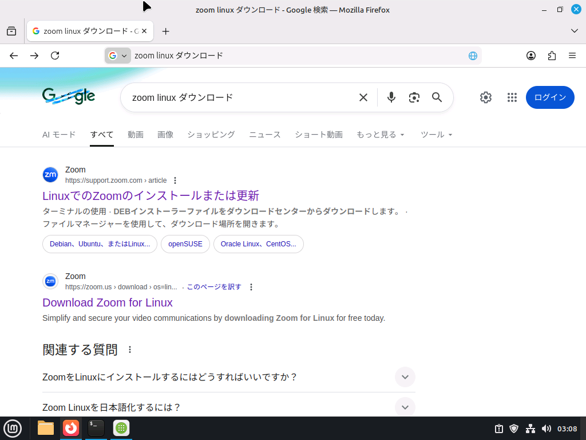

**Download Zoom for Linux**をクリックします。

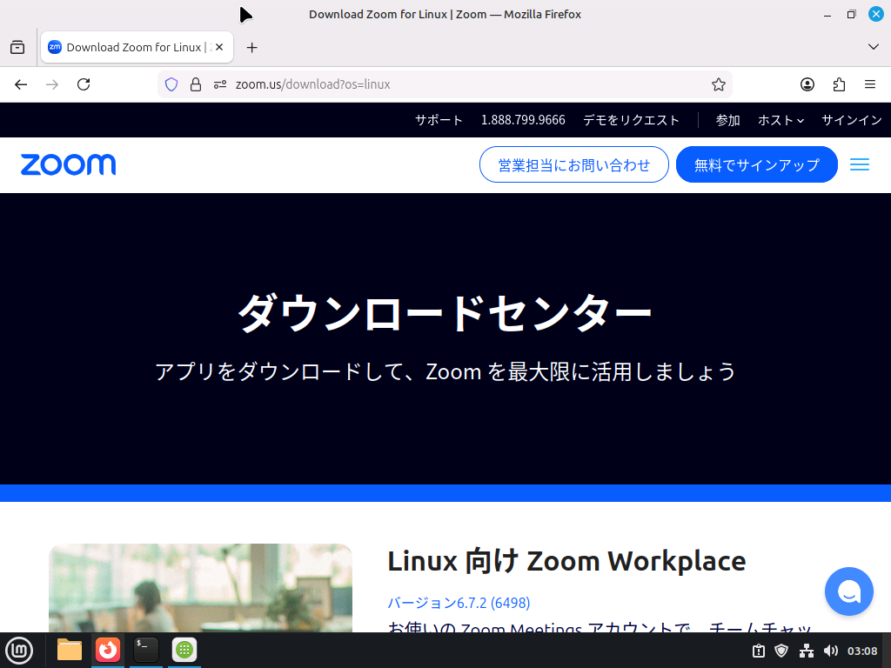

少しだけ下にスクロールします。

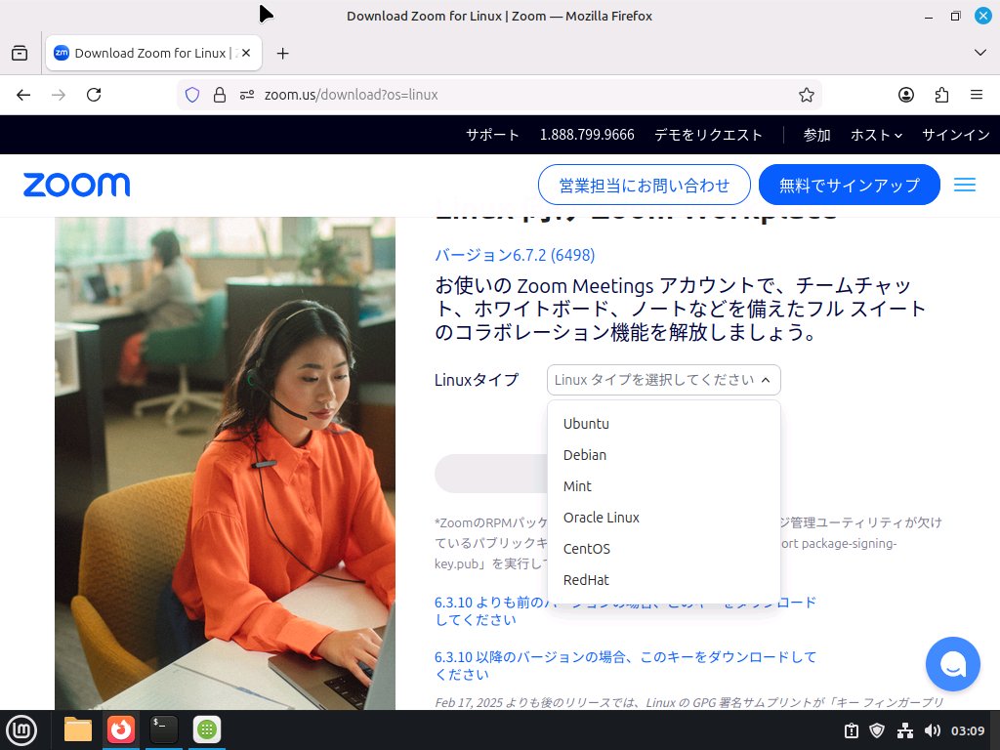

「Linuxタイプ」では「Mint」を選択します。

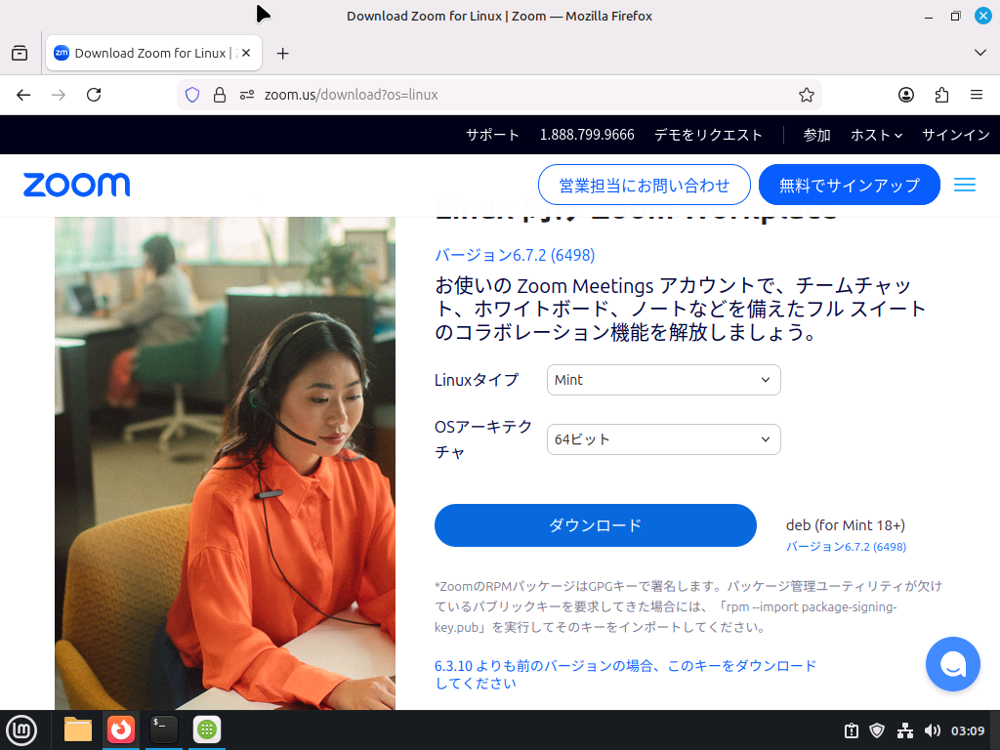

ダウンロードを実行します。

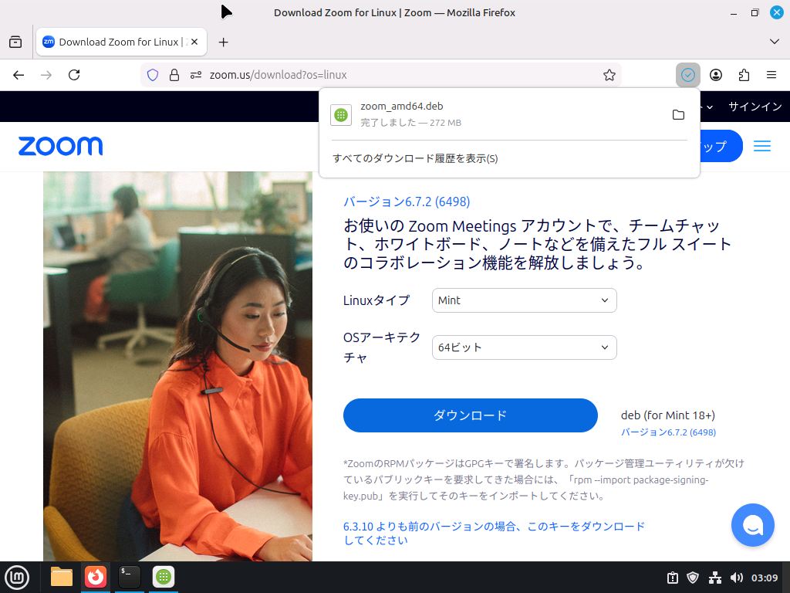

完了したら、右上からダブルクリックして開きます。

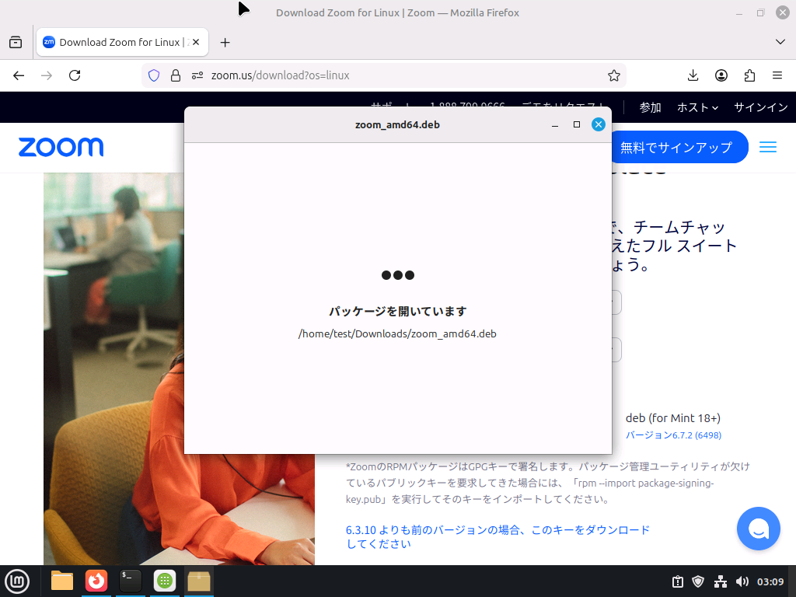

このような画面になります。

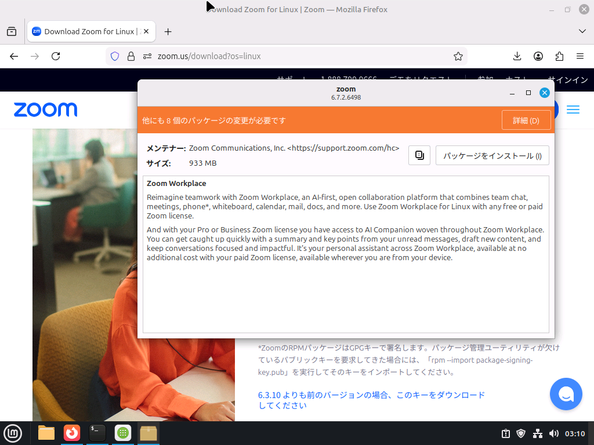

警告のような表示になっていますが、他に必要なパッケージはすべて自動で導入してくれます。

「パッケージをインストール」を押して続行します。

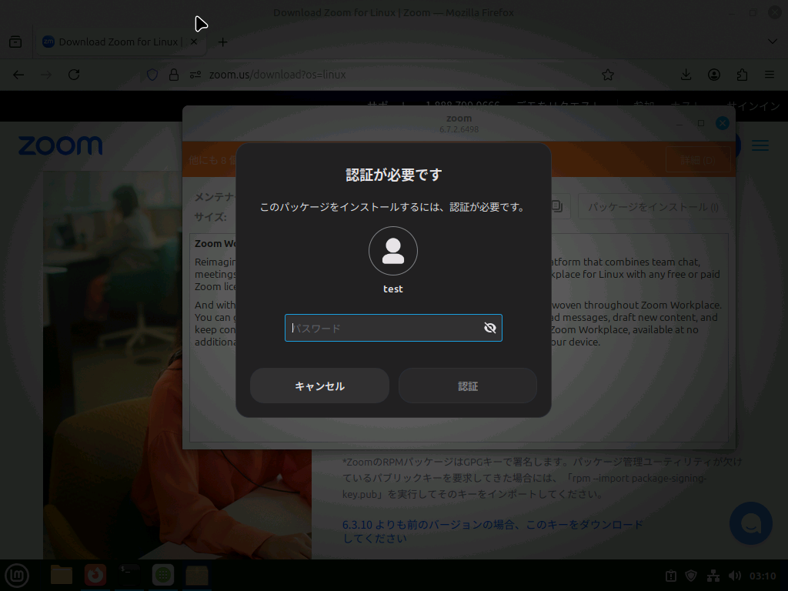

パスワードを入力します。

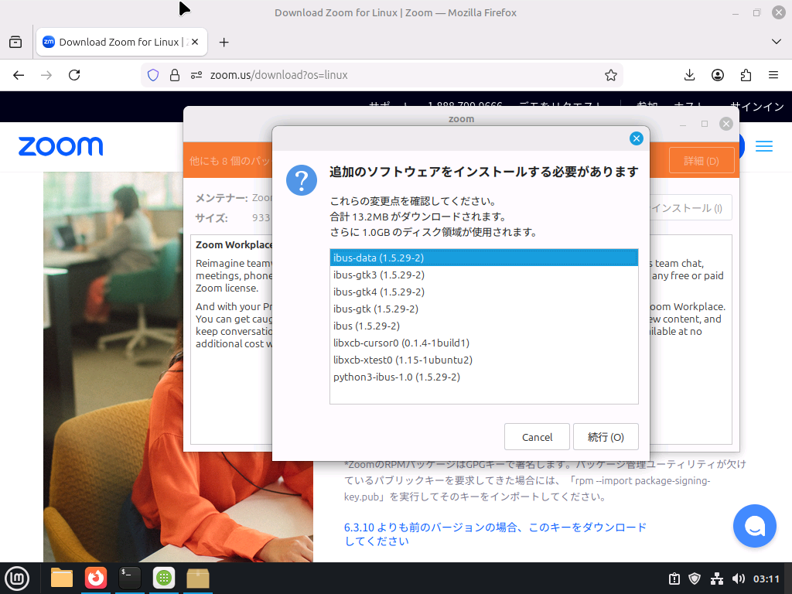

アプリを動かすために前提となるプログラムを一覧で見せてくれます。問題なければ「続行」を押します。

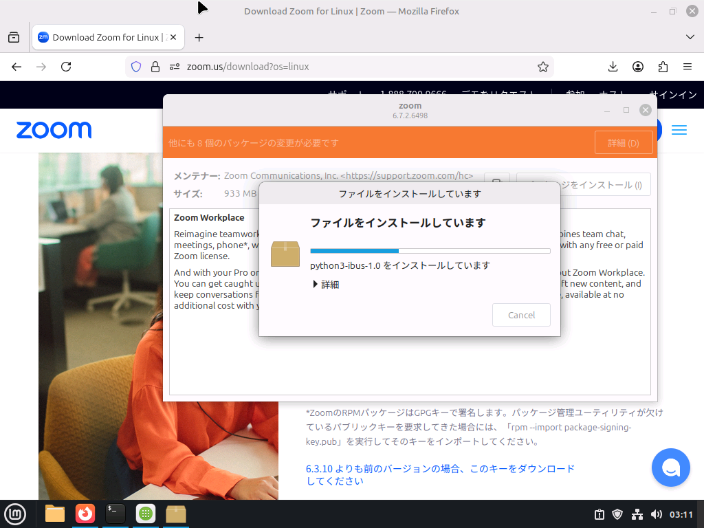

しばらく待機します。

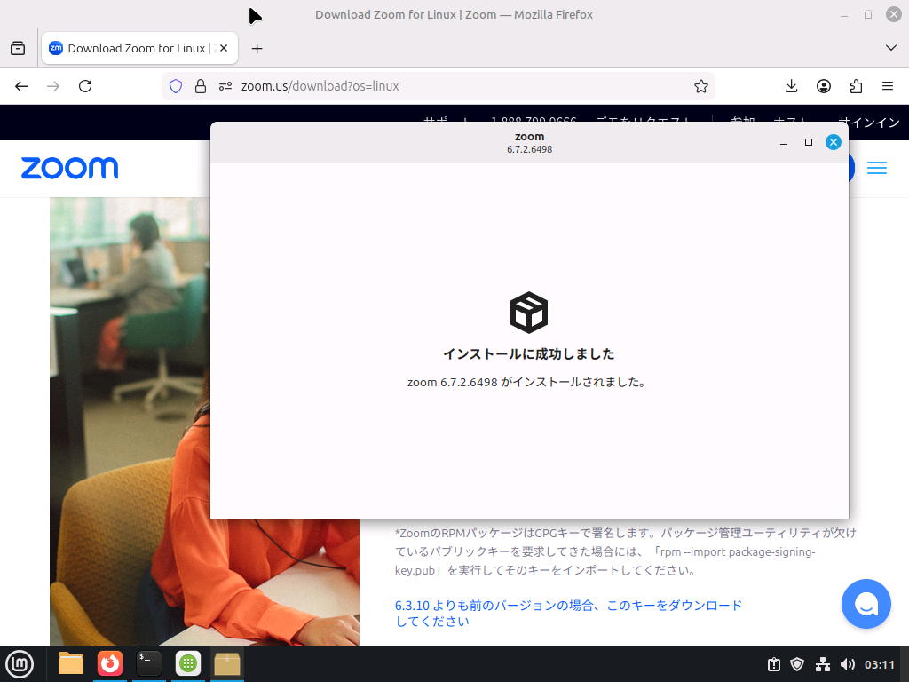

この画面になったら成功です。

## `AppImage`ファイル

AppImage（アップイメージ）は、少し特殊な形式です。

インストールという作業を必要とせず、「そのファイルをダブルクリックするだけでアプリが起動する」 形式です。Windowsの「ポータブル版アプリ」に近いイメージです。

### 使い方の注意点

そのままダブルクリックしても起動しない場合があります。その場合は以下の設定を行ってください。

1. ファイルを右クリックして 「プロパティ」 を開きます。
2. 「アクセス権」 タブを選択します。
3. 「プログラムとして実行可能にする」 にチェックを入れます。
4. 画面を閉じ、もう一度ダブルクリックすると起動します。
