:::warning このページの手順について

このページは、Linux Mintを1から入れたい方に向けて書いています。ほとんどの方は読む必要はありませんので、次のページに進んでください。

:::

「Start Linux Mint 22.2 Cinnamon 64-bit」を選び、Enterを押した場合の進め方です。

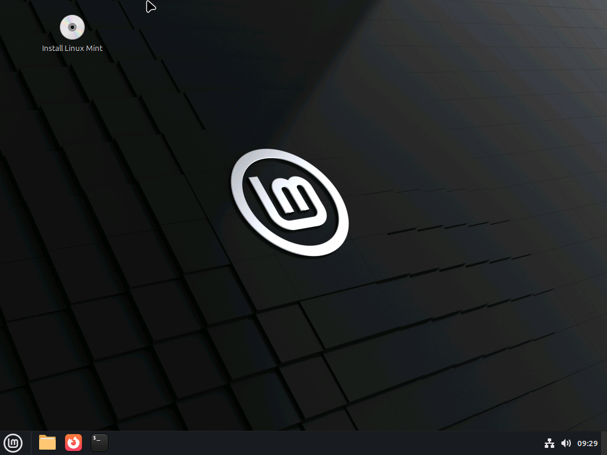

このような画面になります。この状態でアプリを開いたりすると、Linux Mintの使い勝手をインストール前にテストすることができます。

:::danger データは消えます！

この画面で行った操作のデータは消えます。十分注意してください。あくまで「お試し」です。

:::

## インストール手順

### 1. Instlal Linux Mintをダブルクリック

左上にあるCDのアイコンをダブルクリックします。しばらくすると、このような画面になります。

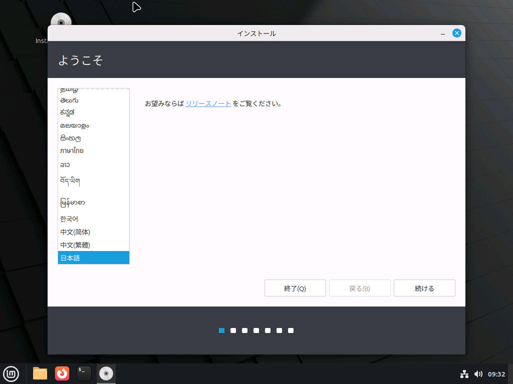

### 2. 各種設定

選択肢を一番下までスクロールし、「日本語」を選んで「続ける」を押します。

:::tip 他の言語の設定

英語に慣れている方は、もちろん英語を選んでいただいても構いません。あとから変更できます。

:::

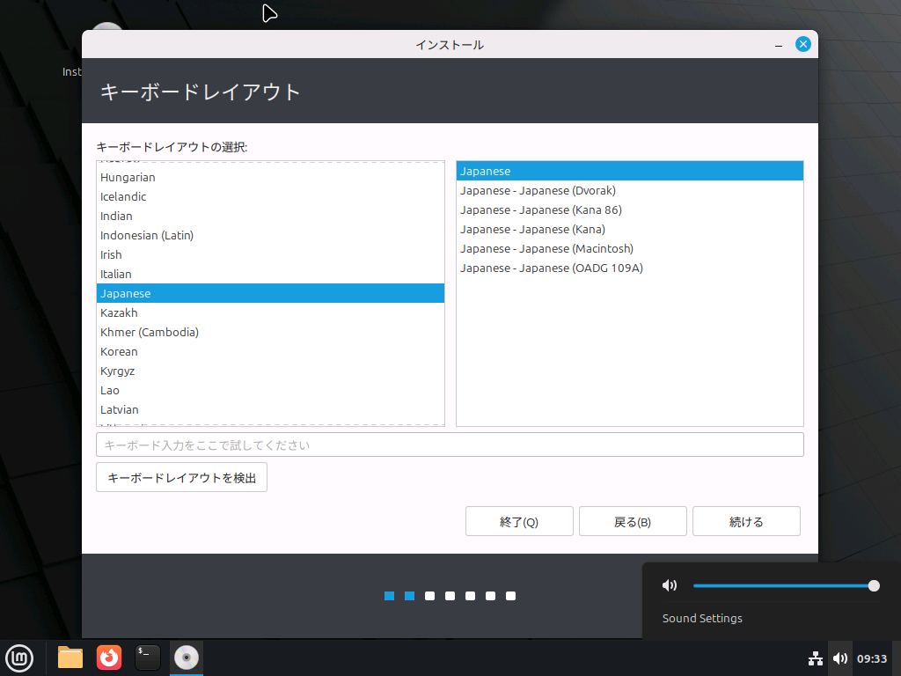

キーボードレイアウトを選択します。

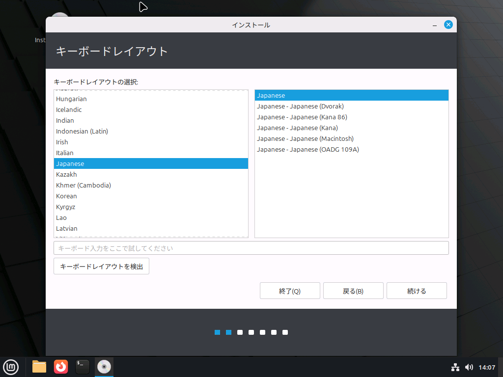

:::tip

USキーボード配列を使っている場合は、English(US)を選ぶといいかもしれません。

:::

マルチメディアコーデックは、特に理由がなければチェックを付けておきましょう。

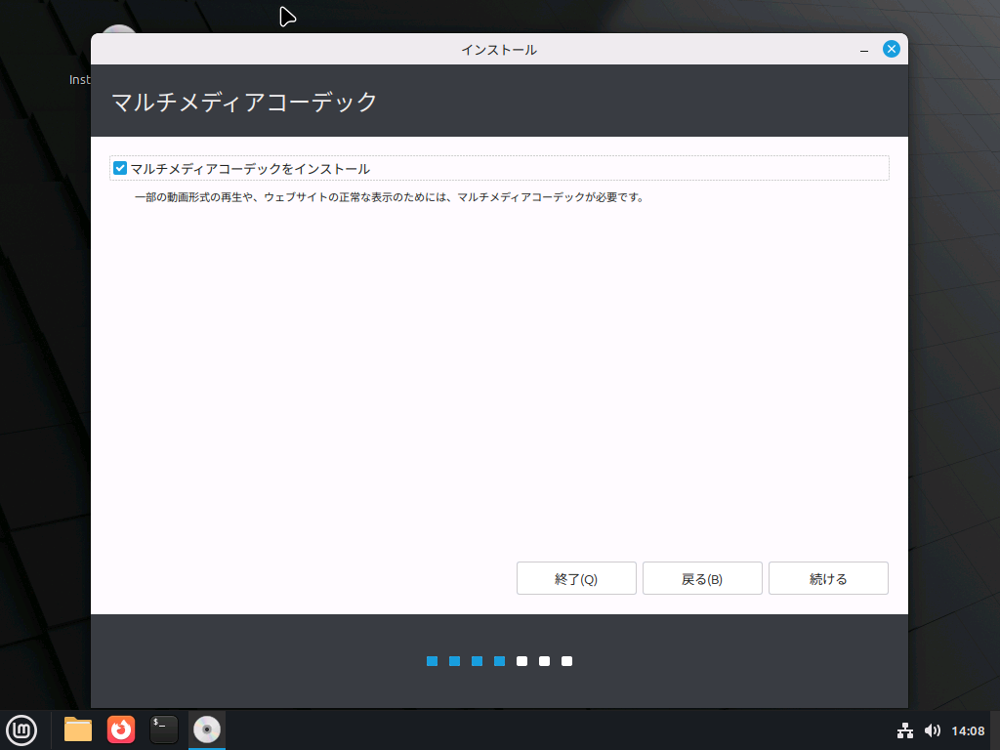

### 3. インストール種類の選択

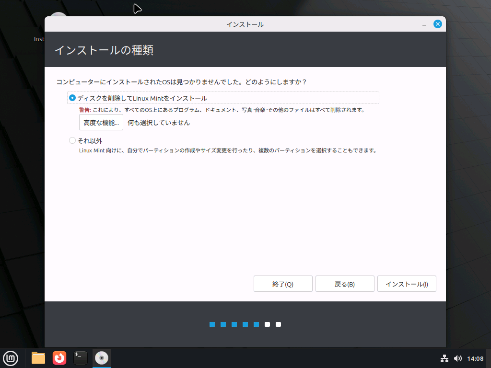

パソコンにWindowsなどが残っているが使わない場合、ディスクを削除しても問題ありません。それ以外の場合（デュアルブートを行う場合）は、パーティションを追加で作るなどして対策する必要があります。今回は、ディスクを削除する方法のみを紹介します。

:::tip

LinuxからWindowsのアプリを動かす方法は存在します。別のページで解説しています。

:::

「高度な機能」の選択画面もあります。

ディスクが2つ以上ある場合、それを1つにまとめたりすることが簡単にできる技術です。今後SSDの増設などを行う予定がある場合はONにしておくといいかもしれません。

また、LVMを有効にすると暗号化が可能になります。

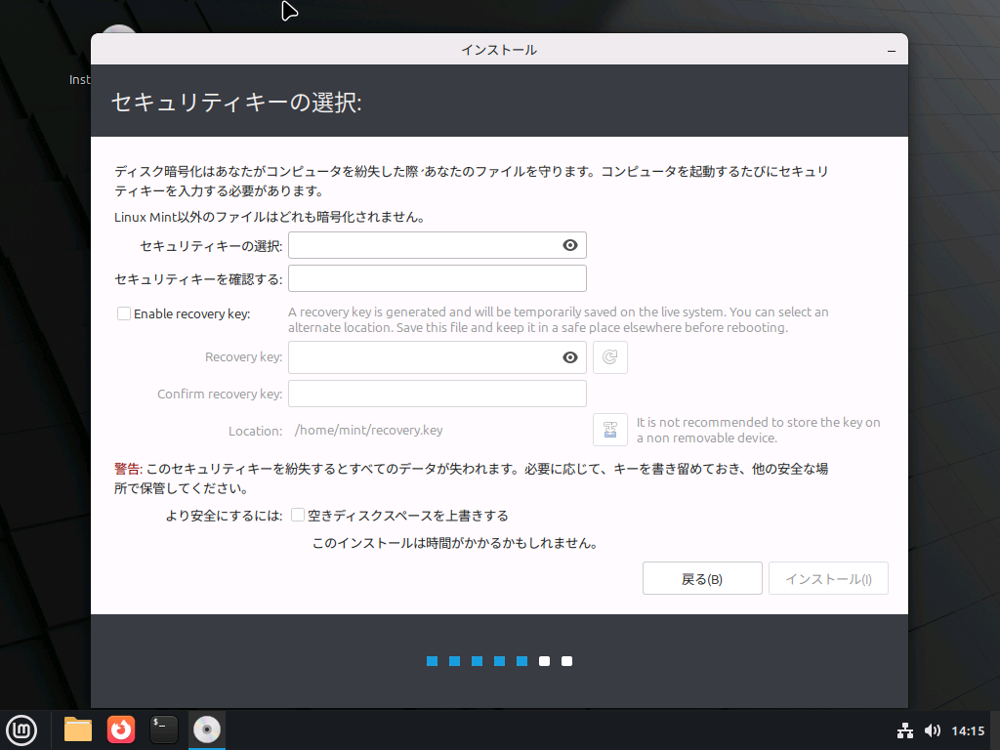

暗号化を有効にした場合のみ、このようになります。必要に応じて使ってみてください。

### 4. インストール確認の承認

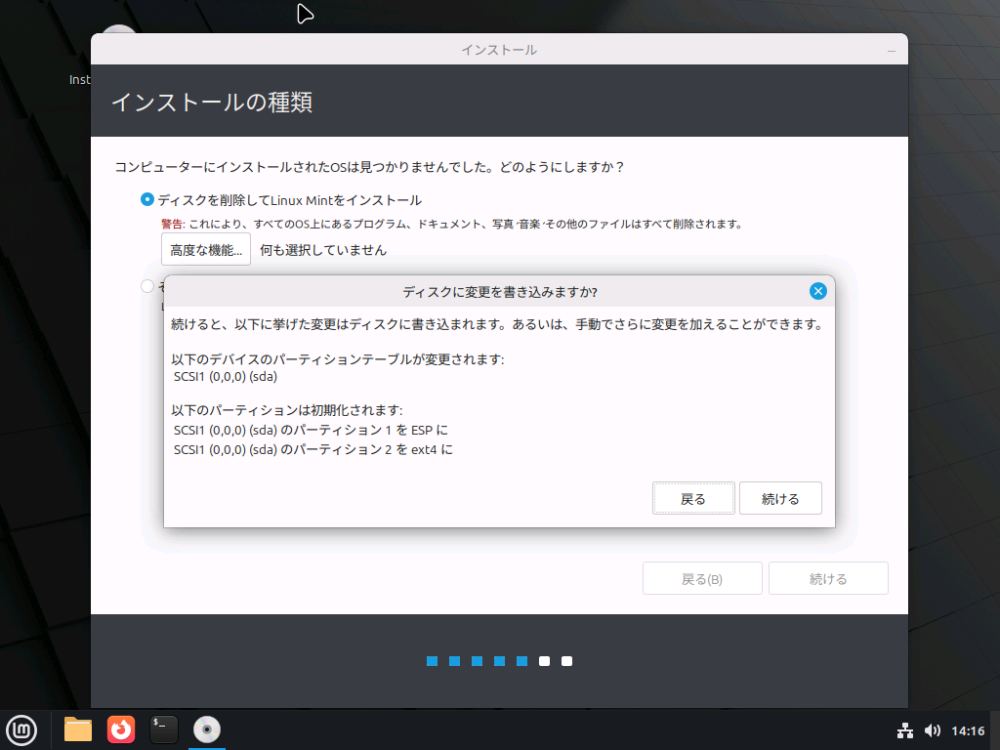

最終的に、このような画面になります。問題なければ「続ける」を押してください。

### 5. 地域などの設定

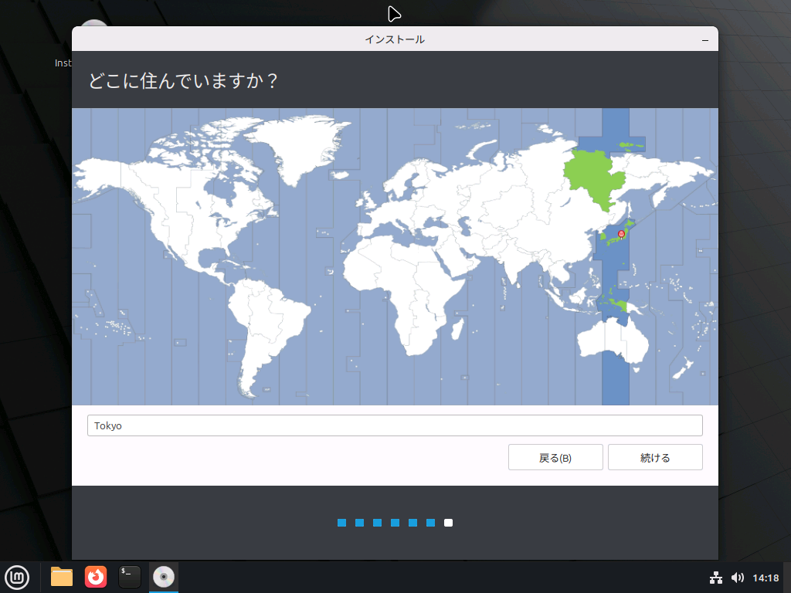

時刻設定などのため、地域を指定します。

### 6. ユーザー作成

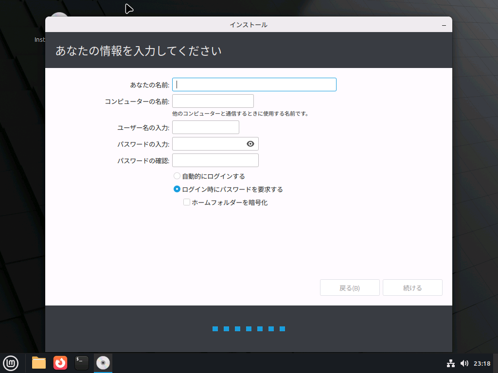

ユーザー名とパスワードを作成します。WindowsのMicrosoftアカウントとは異なり、これはこのパソコンでのみ有効となります。

「コンピューターの名前」のみユーザー名とは特に関係のない端末の名前になります。

例えば、このように入力します。パスワードは本当はちゃんとしたものを使ってください。

### 7. インストール開始

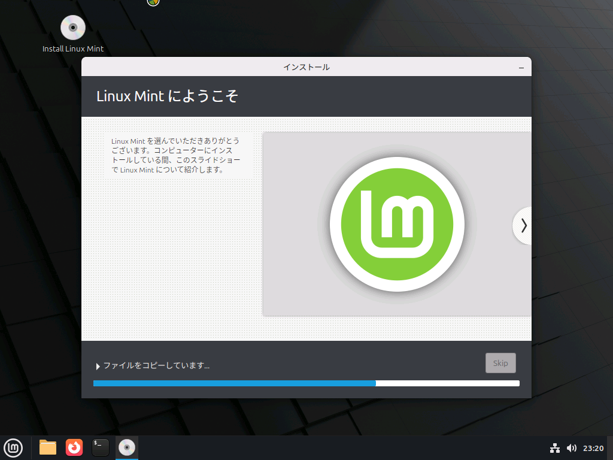

インストールが正常に始まると、このような画面に切り替わります。スライドショーを読みながら待機しましょう。

### 8. インストール完了

インストールが完了すると、この画面になります。

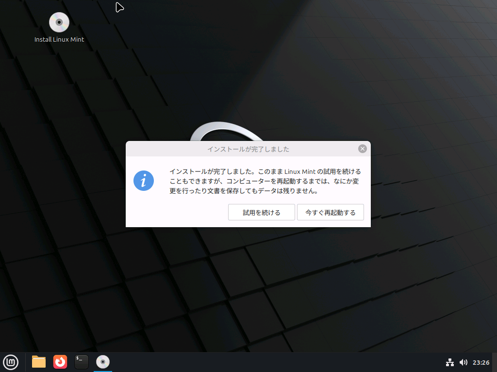

「今すぐ再起動する」を押しましょう。

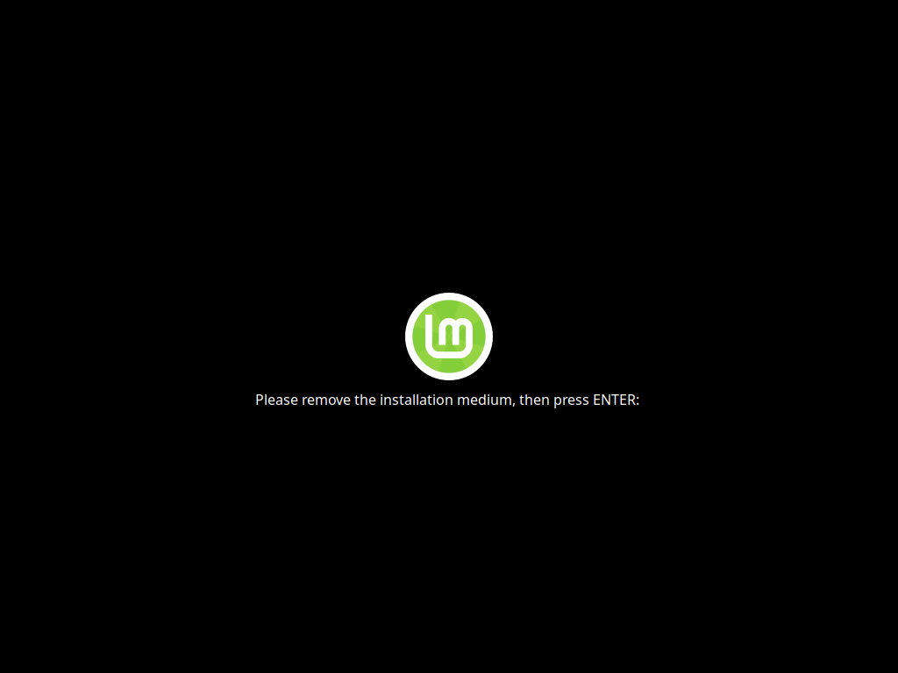

この画面になったら、インストールに使用したUSBメモリなどを取り外してEnterを押します。

### 9. ログイン

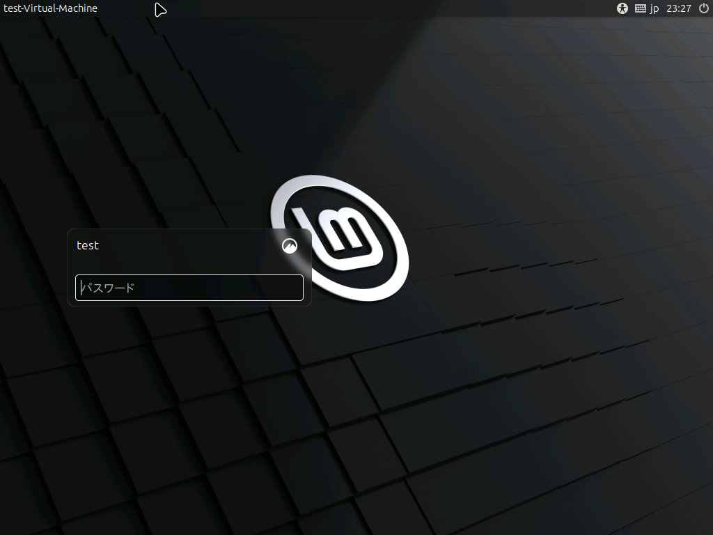

手順6で決めたパスワードでログインします。

これですべての作業は完了です。