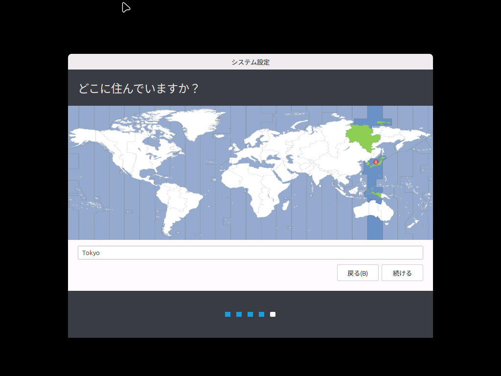
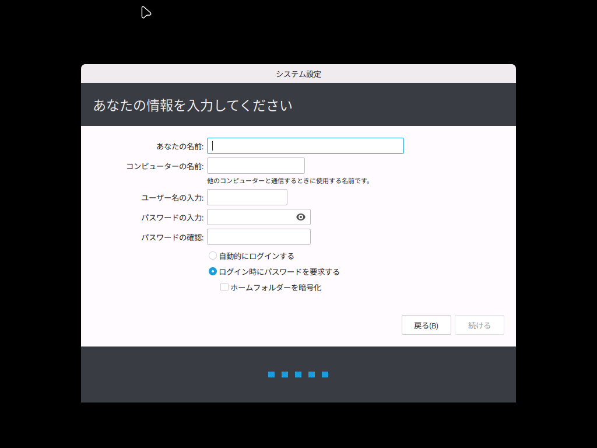
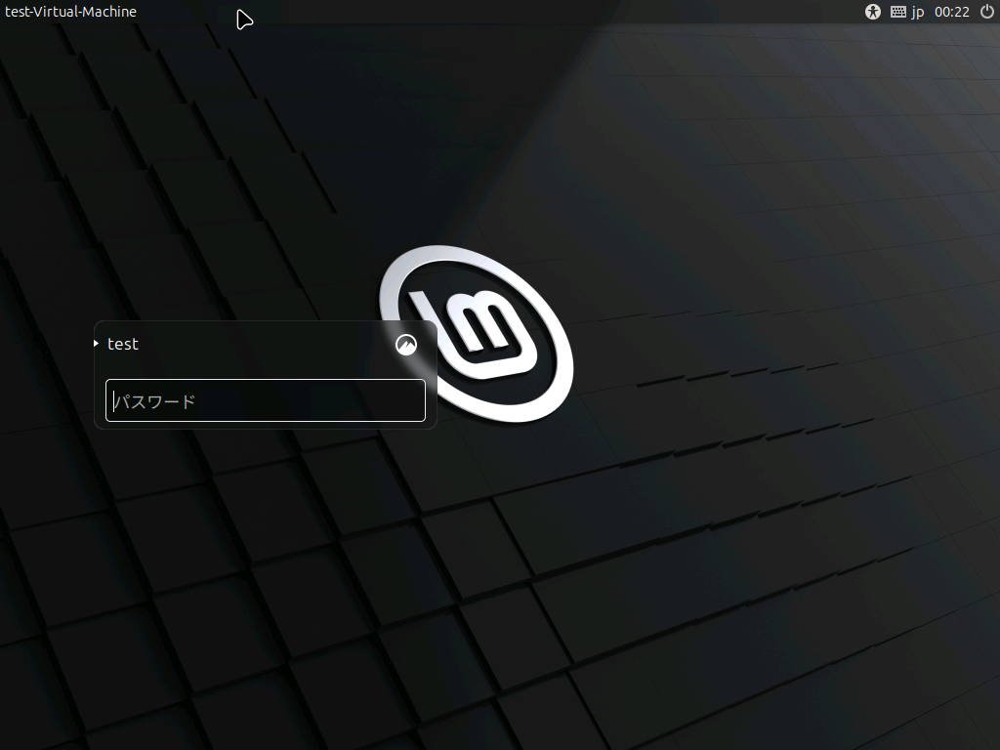

Linux Mint使用開始時のユーザーの作成について説明します。

## 初回起動時に設定する内容

### 1. 地域選択

タイムゾーンの設定などのため、地域を入力します。

### 2. ユーザーの作成

ユーザー名とパスワードを作成します。WindowsのMicrosoftアカウントとは異なり、これはこのパソコンでのみ有効となります。

「コンピューターの名前」のみユーザー名とは特に関係のない端末の名前になります。

例えば、このように入力します。パスワードは、パソコンに重要な変更を加えるとき（アプリインストールなど）に毎回入力することになります。

この画面になったら、パスワードを入力します。

この画面になったら成功です。お疲れさまでした。