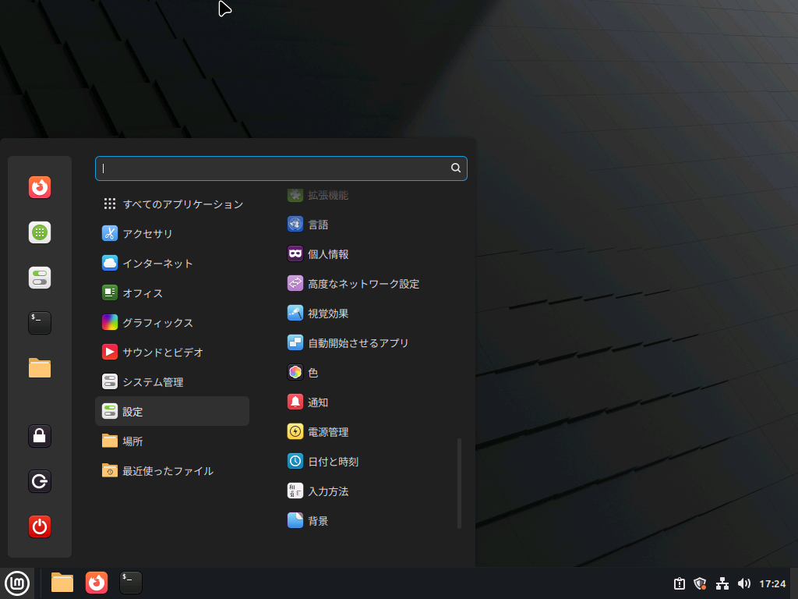
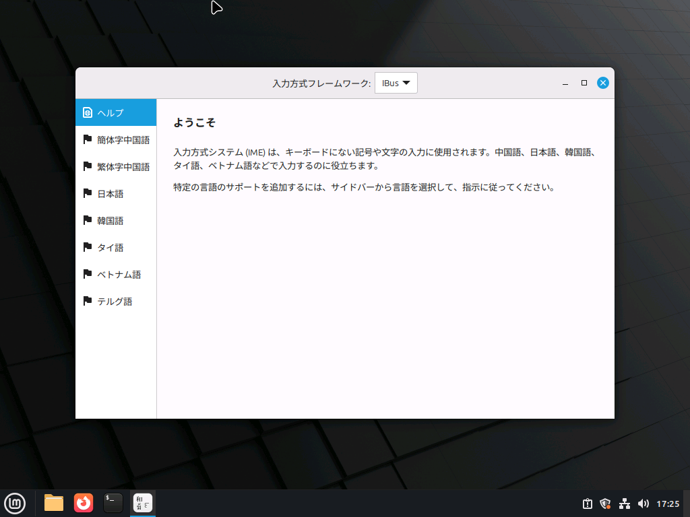
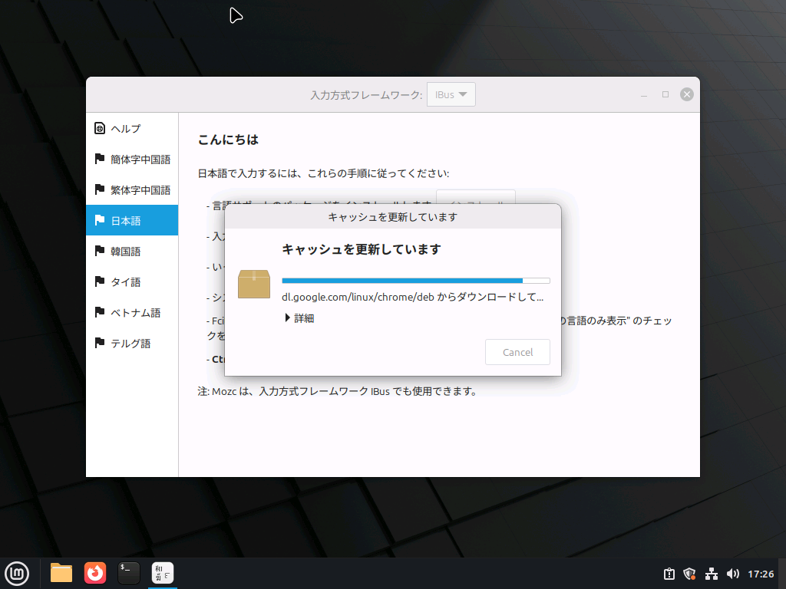
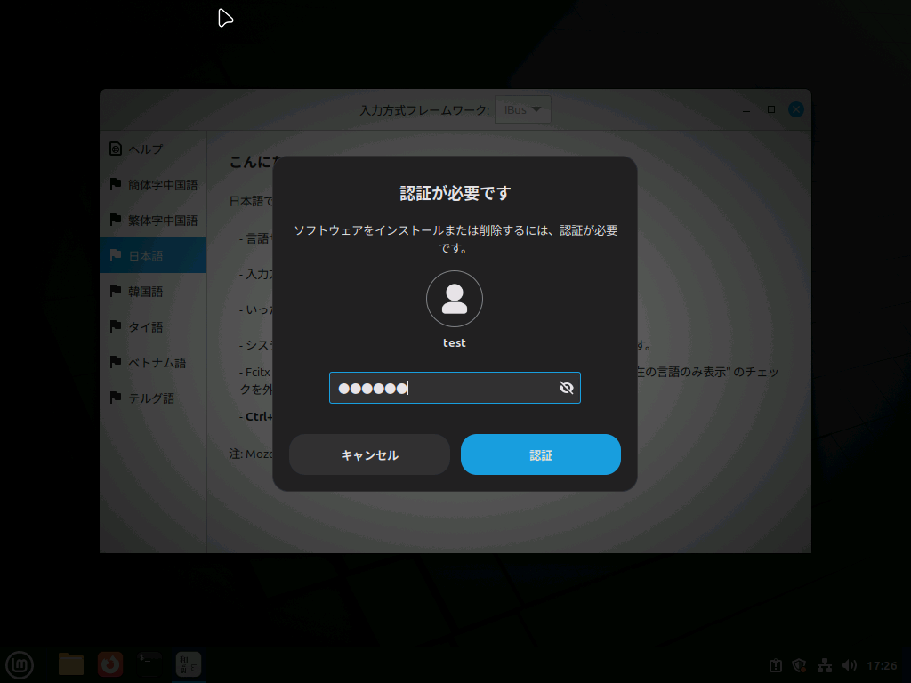
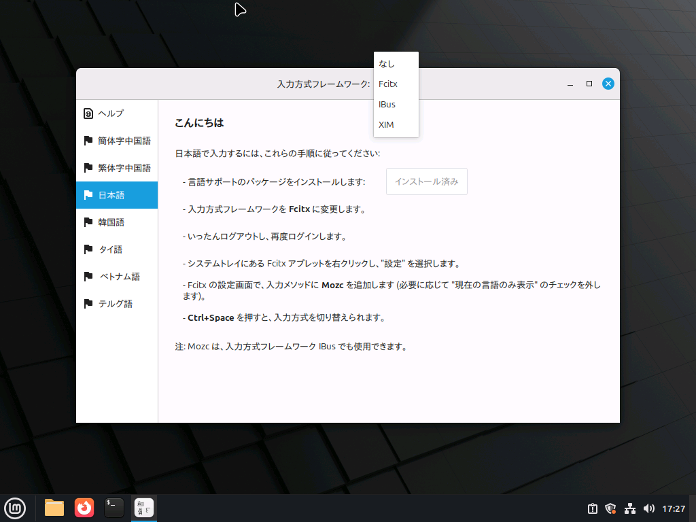
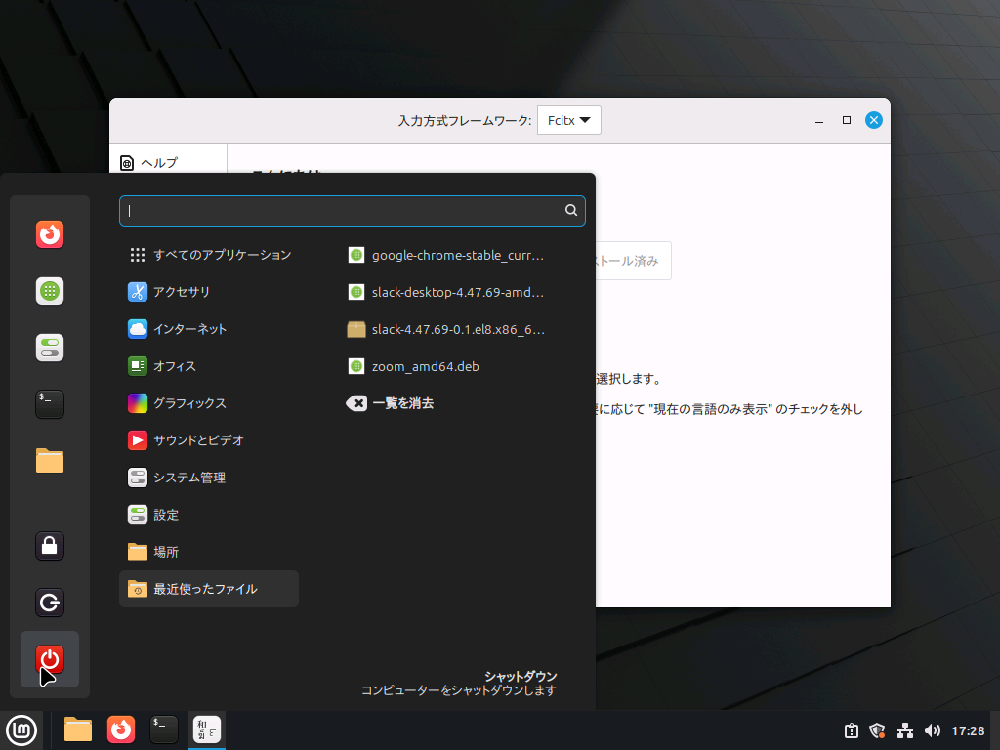
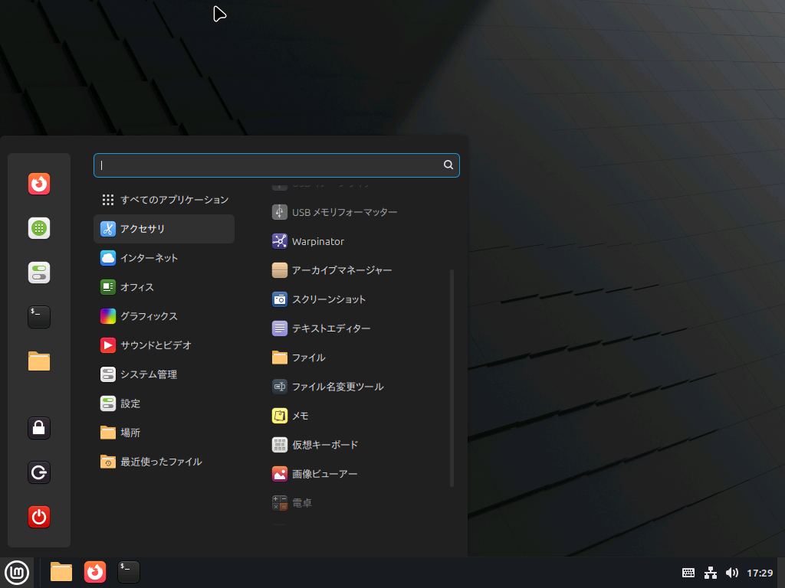
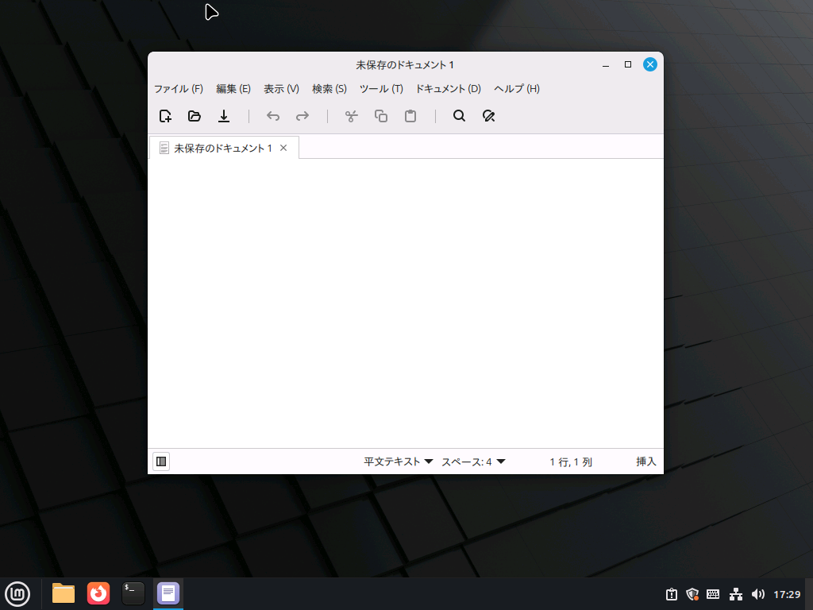
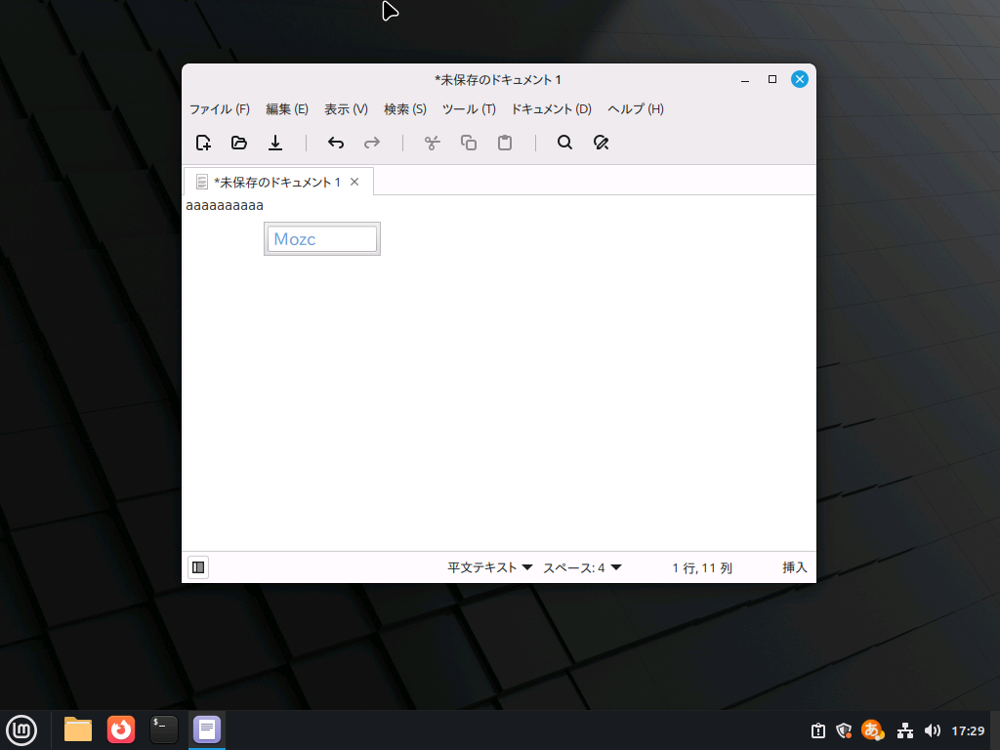
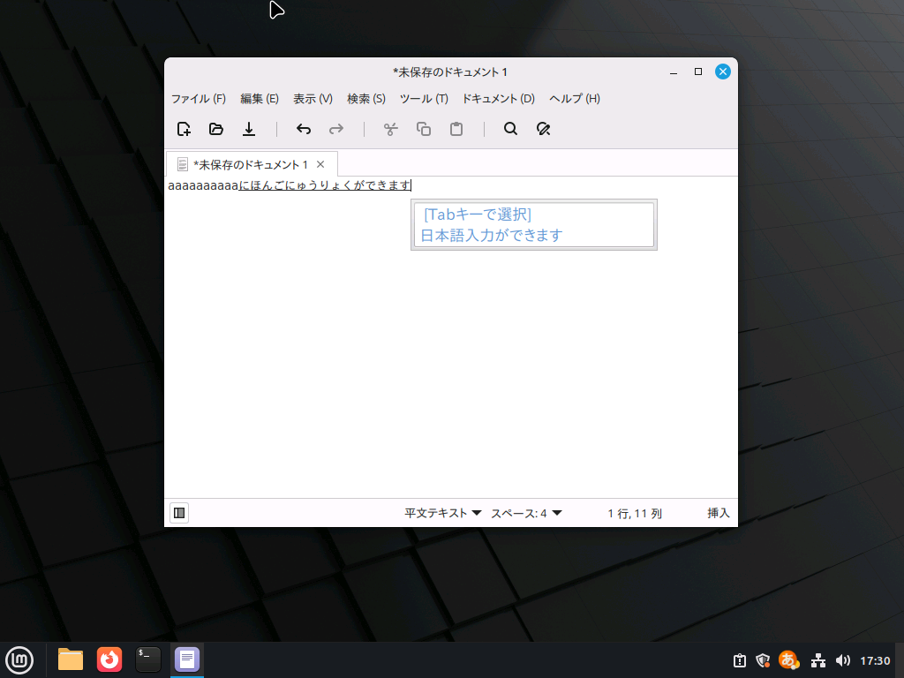

Linux Mintは、設定無しでは**日本語の入力ができません**。このページの内容に従って設定を行ってください。

:::tip

OEM事業者の方は、この手順をあらかじめ実行しておくことで利用者の方が最初から日本語入力可能な状態で使うことができるようになります。

:::

## 手順

### 1. 設定を開く

アプリメニュー→設定→入力方法　の順番でクリックします。

「日本語」をクリックします。

### 2. Fcitxのインストール

画面上部の「インストール」ボタンをクリックします。

認証して続行します。

インストールが完了したら、ウィンドウの一番上にある「入力方式フレームワーク：iBus▼」を「Fctix」に変更します。

### 3. ログアウトまたは再起動

一旦ログアウトまたは再起動します。

### 4. 入力を試す

ブラウザを開くか、アプリメニュー→アクセサリ→テキストエディター　から試すのがおすすめです。

ここでは、テキストエディターを使います。

キーボード左上の「全角・半角」キーを押すか`Ctrl`と`Space`を同時押しすると、「Mozc」という表示が出てきます。

この状態で文字を打つと、日本語入力をすることができます。スペースやTabキーで変換を実行できます。

