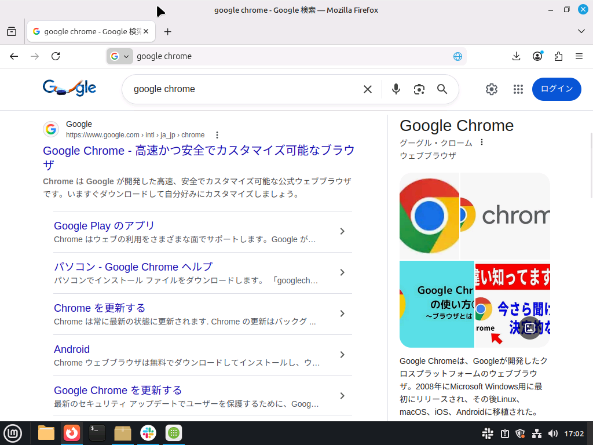
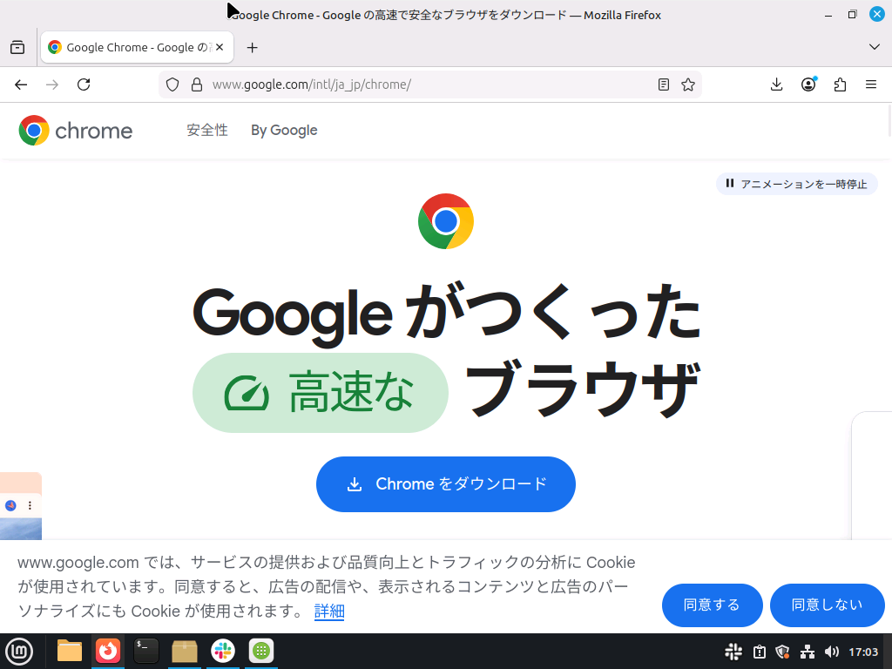
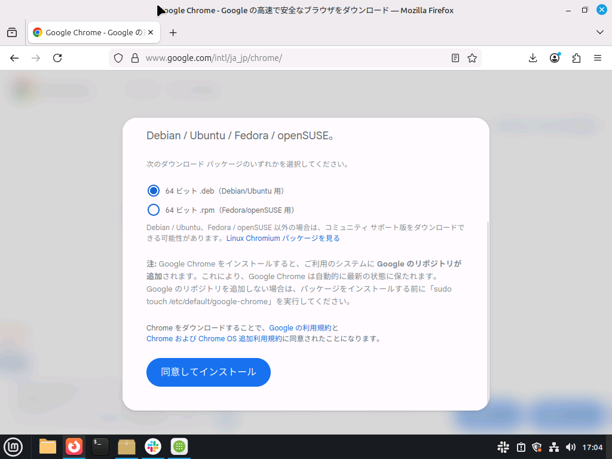
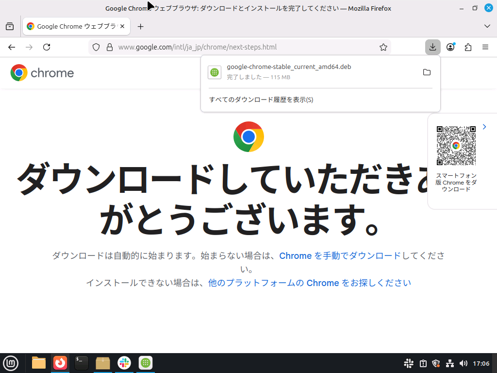
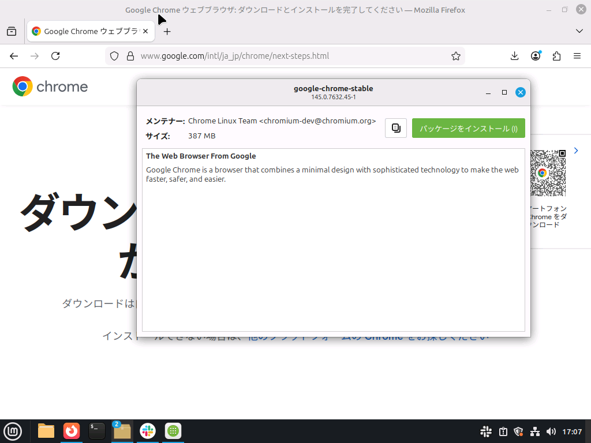
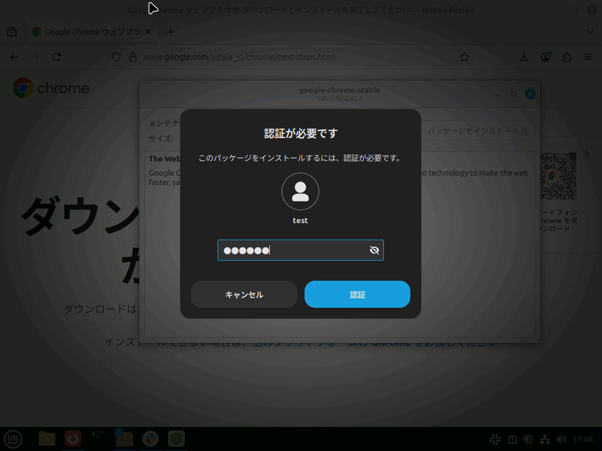
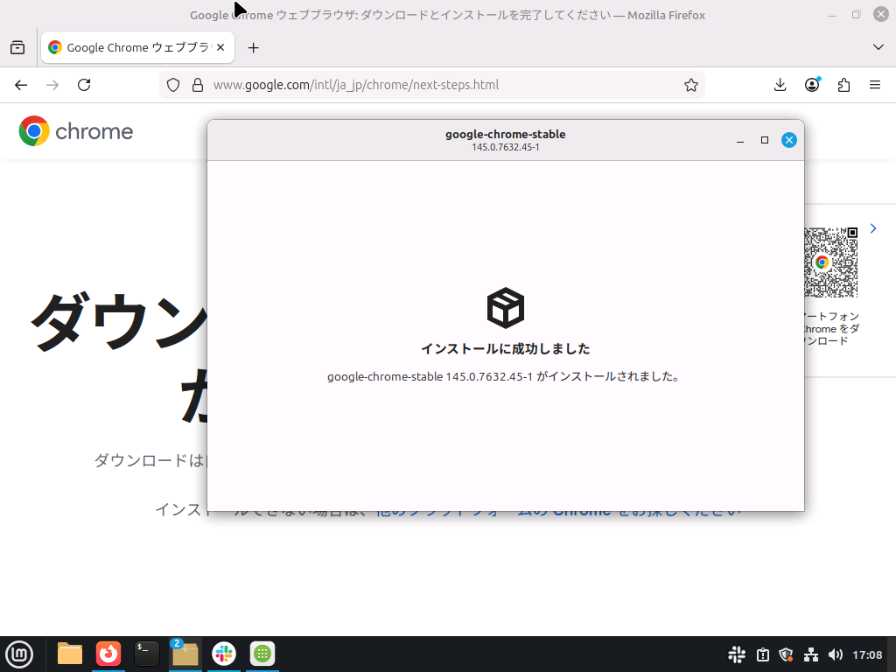

普段他のスマホやパソコンでGoogle Chromeをお使いの方は、FirefoxではなくGoogle Chromeを引き続き使用することもできます。

## 手順A（.debパッケージを導入する方法）

### 1. 検索

Firefoxを開き、「Google Chrome」で検索します。

### 2. ダウンロード

ダウンロードを実行します。

「64 ビット .deb」を選んで続行します。

下にスクロールし、「同意してインストール」を押します。

右上の「google-chrome-stable_current_amd64.deb」をクリックします。

「パッケージをインストール」を押します。

認証して続行します。

この画面になったら成功です。

メニューボタンを押して、Google Chromeがあることを確認します。

