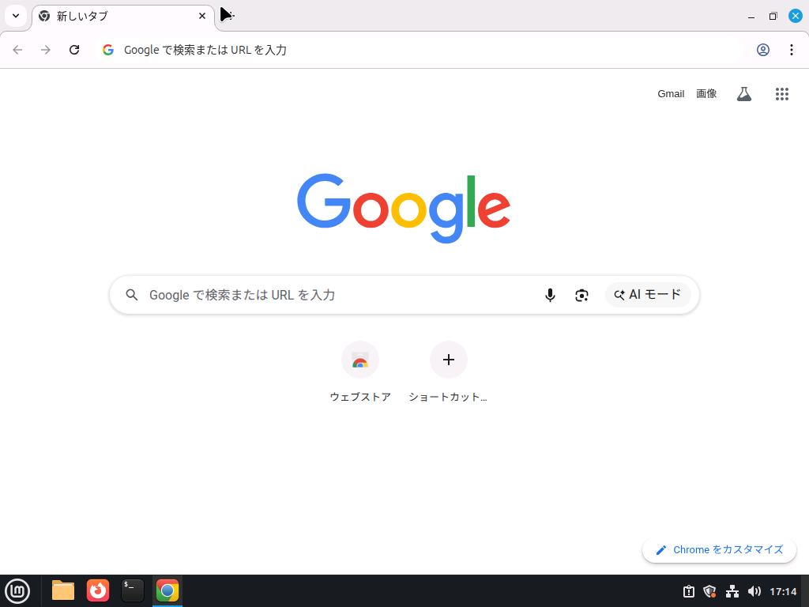
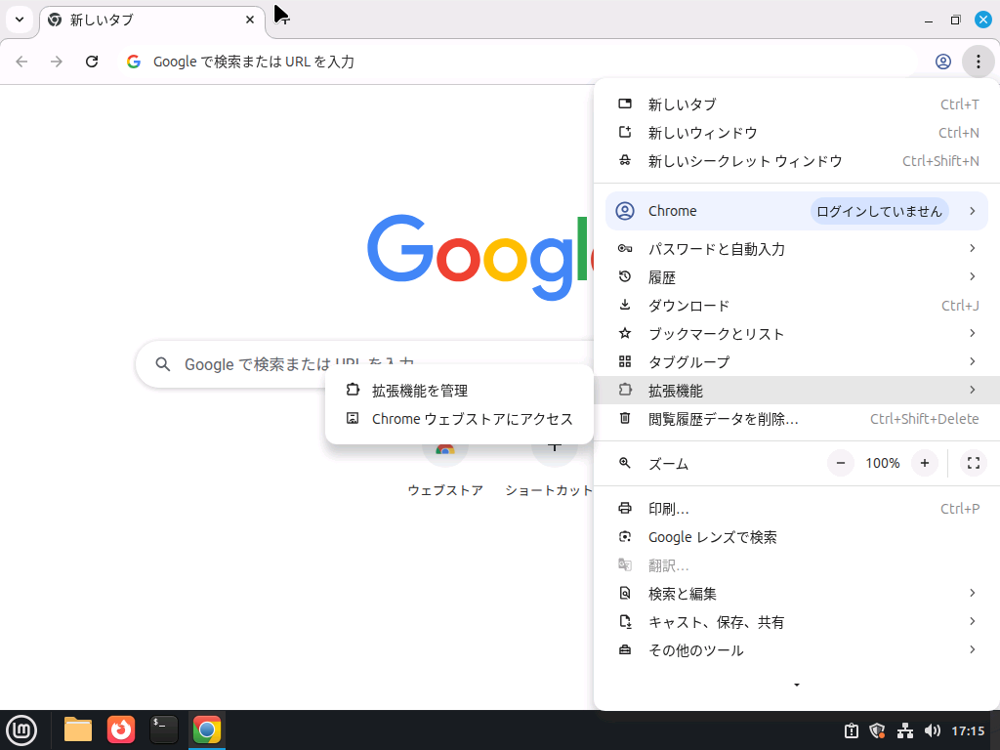
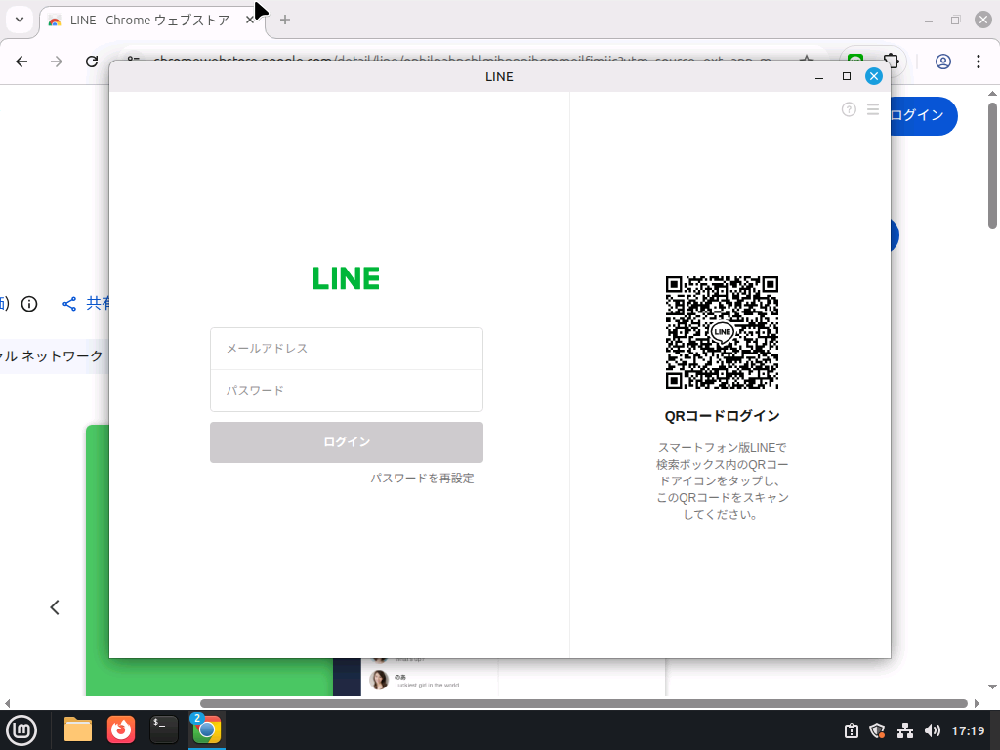

LINEのLinux用アプリは存在しませんが、Google Chromeの拡張機能として導入することができます。そのため、あらかじめ[Google Chromeをインストール](./chrome)してからご覧ください。

:::warning

Firefox用の非公式ポートもありますが、LINEはサードパーティー製のクライアントを禁止しているため使わないほうがいいと思います。

https://addons.mozilla.org/ja/firefox/addon/line-firefox-ported/

:::

## 手順

Google Chromeのインストールは完了しているものとします。

### 1. 拡張機能ストアにアクセス

Google Chromeを起動し、拡張機能ストアにアクセスします。

右上の「⋮」→拡張機能→Chromeウェブストアにアクセス　の順で進みます。

アプリストアが開きます。

「line」で検索します。

おなじみのアイコンが出てきたら、クリックします。

下にスクロールし、提供元が「LY Corporation」であることを確認します。**これ以外は偽物です**。

問題なければ上にスクロールしたあと画面幅が小さければ少し右にスクロールし、「Chromeに追加」を押します。

問題なければ追加します。

このような画面になれば成功です。今後は、右上のパズルのピースのようなアイコンを押してログインします。

ピン留めのアイコン（📌のようなアイコン）を押すと、常に右上に表示させることもできます。

画面の指示に従ってログインしてください。

