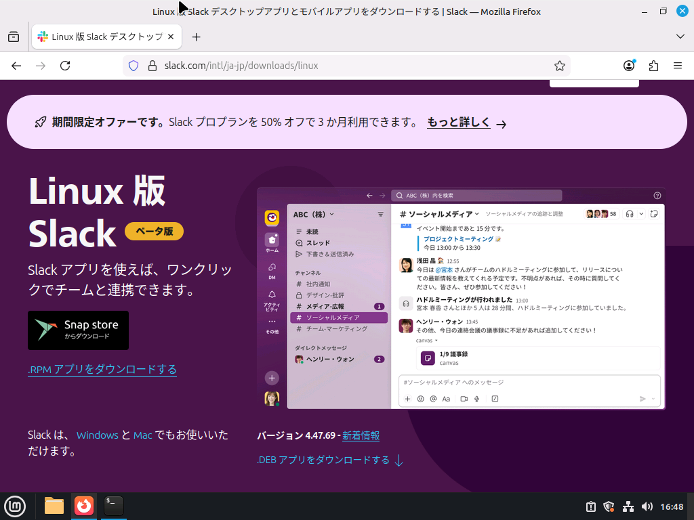
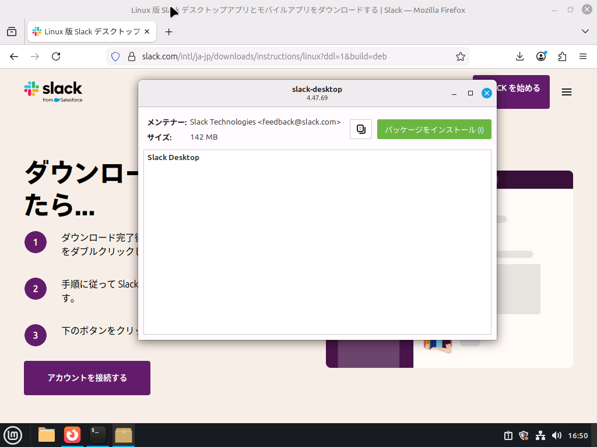
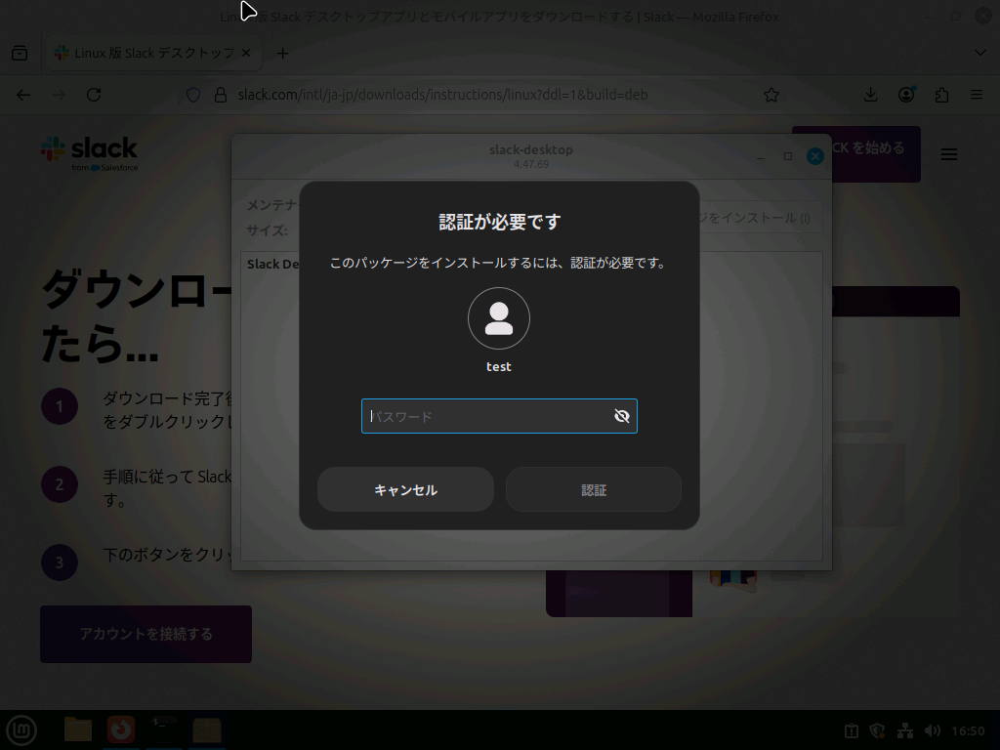
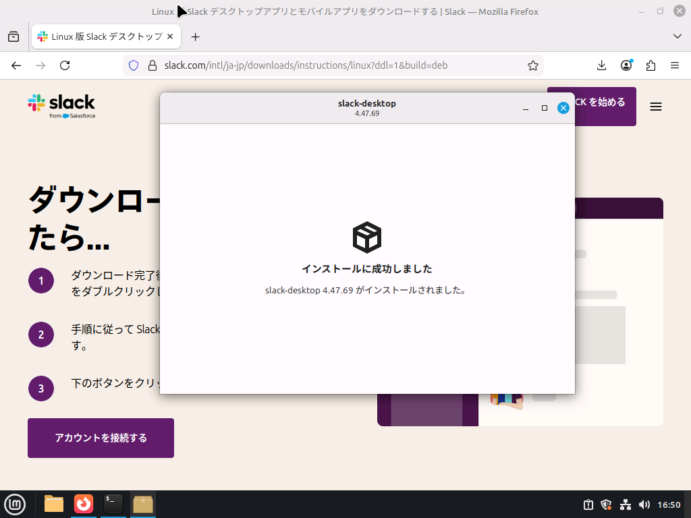
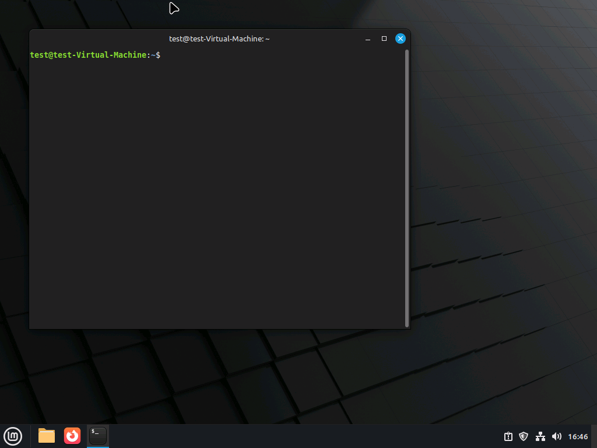

Linux MintにSlackを入れたい場合、少しだけ手間がかかります。やり方を解説します。

## 手順A（.debパッケージを導入する方法）

### 1. ページにアクセス

https://slack.com/downloads にアクセスします。



### 2. 「.DEBアプリをダウンロードする」をクリック

少し下にスクロールして、「.DEBアプリをダウンロードする」をクリックします。

### 3. インストール


右上の`slack-desktop-（バージョン）-amd64.deb`をクリックします。





認証し、インストールを実行します。


この画面になったら成功です。メニューボタンを押すと、Slackがあるはずです。



サインインしてご利用ください。


## 手順B（flatpakを使用する方法）

:::danger

この手順は中級者向けです。また、Slack公式ではなくコミュニティが開発して維持をしているため、打ち切りになる可能性が少なからず存在します。特に業務用端末ではおすすめしません。

:::

### 1. ターミナルを起動

ターミナルを起動し、黒い画面を出します。



### 2. コマンドを入力

以下のコマンドを入力します。

:::warning

大文字と小文字に気をつけてください。

:::

```
flatpak install flathub com.slack.Slack
```

## 手順C（Snapを使用する方法）

:::danger

この手順は上級者向けです。システムに中規模の変更を加えます。

:::

### 1. ターミナルを起動

ターミナルを起動し、黒い画面を出します。


### 2. Snapを有効化し、インストールする

:::tip

お使いのLinux Mintでこのページを開いていただくと、コードをコピーできます。また、ターミナルへは右クリックまたは`Ctrl+Shift+V`で貼り付けができます。

:::

このコードは、Snapの有効化からSnapとSlackのインストールをすべて含んでいます。順番に実行してください。

```
sudo mkdir /etc/apt/preferences.d.off
sudo mv /etc/apt/preferences.d/nosnap.pref /etc/apt/preferences.d.off/
sudo apt install snapd
sudo snap install slack
cp /var/lib/snapd/desktop/applications/slack_slack.desktop ~/.local/share/applications/
```

参考：https://forums.linuxmint.com/viewtopic.php?t=440418